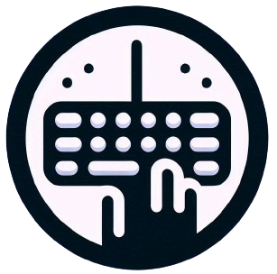

<div align="center">

  
  <h1>getKeyCode</h1>
  
  <p>
    ⌨️ getKeyCode es una aplicación web interactiva diseñada para capturar y mostrar el código de cada tecla presionada en un teclado estándar de EE.UU. (US standard 101). Esta herramienta es ideal para desarrolladores, educadores y cualquier persona interesada en comprender cómo se asignan los códigos a las teclas en un teclado.
  </p>


<!-- Badges -->
<p>
  <a href="">
    
  </a>
  <a href="https://github.com/hectorgarciatw/getKeyCode/issues/">
    
  </a>
  <a href="https://github.com/hectorgarciatw/getKeyCode/master/LICENSE">
    
  </a>
  <a href="https://github.com/hectorgarciatw/getKeyCode">
    
  </a> 
</p>
   
<h4>
    <a href="https://github.com/hectorgarciatw/getKeyCode">View Demo</a>
  <span> · </span>
    <a href="https://github.com/hectorgarciatw/getKeyCode">Documentation</a>
  <span> · </span>
    <a href="https://github.com/hectorgarciatw/getKeyCode/issues/">Report Bug</a>
  <span> · </span>
    <a href="https://github.com/hectorgarciatw/getKeyCode/issues/">Request Feature</a>
  </h4>
</div>

## Características Principales

- **Detección en Tiempo Real**: La aplicación detecta y muestra instantáneamente el `keyCode` de cada tecla presionada.
- **Interfaz Intuitiva**: La interfaz es sencilla y fácil de usar, proporcionando una experiencia de usuario fluida.
- **Compatibilidad Completa**: Funciona con todos los navegadores modernos y es compatible con dispositivos que utilizan el teclado estándar de EE.UU.

## ¿Cómo Funciona?

- **Captura de Tecla Presionada**: Cada vez que el usuario presiona una tecla, la aplicación captura el evento de teclado.
- **Muestra del keyCode**: El código asociado a la tecla presionada se muestra en la pantalla de forma clara y legible.
- **Actualización Dinámica**: La información se actualiza dinámicamente con cada nueva tecla presionada, sin necesidad de recargar la página.

## Utilización de manera local

1. **Clona el repositorio**:
    ```bash
    git clone https://github.com/hectorgarciatw/getKeyCode.git
    ```
2. **Navega al directorio del proyecto**:
    ```bash
    cd getKeyCode
    ```
3. **Instala las dependencias**:
    ```bash
    npm install
    ```
4. **Inicia la aplicación en modo de desarrollo**:
    ```bash
    npm run dev
<br />
